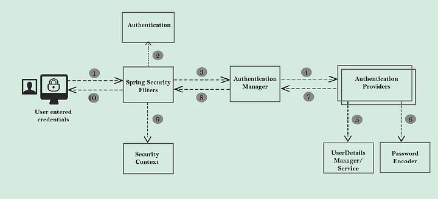

# 
Notatki do Spring Security

### [link do md](https://www.markdownguide.org/basic-syntax/)
### [link do tego jak grafy robic](https://mermaid.js.org/intro/syntax-reference.html)

# 
Teoria :

### Authentification & Authorization 
 Authentification = kim jestes  
 Autorization = co możesz robic

### AUTHRORITY = akcje ktore mozesz wykonywac
np. CREATE_USER, LOG_IN
### ROLE = zbior twoich permisjii
### PRINCIPAL = info o zalogowanym userze
### FILTRY
Filtry są po to żebyś był najpierw sprawdzony czy istniejsz i czy masz pozwolenia na zrobienie czegos 
zanim dotrzesz do logiki

### DATASOURCE  
Datasource to źródło pobierania danych o użytkowniku,  
który chce się zalogować  u nas tym źródłem jest baza danych. 
**NIE** trzeba robic implementacji DataSource w kodzie jesli ma sie to w pliku  
[application.properties](application.properties)

## FILTRY SECURITY** 
[Link do filmiku opisującego teorie](https://youtu.be/caCJAJC41Rk?si=_Cciv1DGFa2CrmEf) 
### TLDR:  
1. Ktoś chce dostać do czegoś dostęp
2. Wysłane jest info o tym do **IMPLEMENTACJI** AuthenticationManagera
3.  AuthenticationManager pyta każdego AuthenticationProvidera **po kolei**  którego mamy zaimplementowanego w kodzie o to czy ten ktoś jest gitem
4. Jeśli AuthenticationProvider wykona metode `authenticate()` prawidłowo to zwraca info o tym, że ten ktoś jest gitem. 
Jeśli żaden AuthenticationProvider nie zwróci info to AuthentificationManager nie zwraca `PRINCIPAL` użytkownika i dostęp kończy się niepowodzeniem.
5. Jeśli udało się Providerowi sprawdzić użytkownika z powodzeniem AuthentificationManager zwraca ``PRINCIPAL``  do chłopka co zażyczył dostępu.
  
[Artykuł do Filtrów z medium](https://medium.com/@tanmaysaxena2904/spring-security-the-security-filter-chain-e09e1f53b73d)  
 

